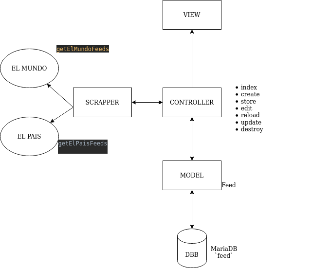

## About Daily Trends

Daily Trends is a website platform to create and retrieve your own news feeds. A user can retrieve news feeds from "El Pais" or "El Mundo" using a web-scrapping method. 

## Infrastructure used
* Laravel 8 
* MariaDB
* Docker
* PHP 7

## Third party libraries
* **laravelcollective/html**: HTML and Form builder
* **fabpot/goutte**: Web screen scraping and web crawling library for PHP
* **twbs/bootstrap**: CSS Framework for views

## Installation
Extract the zip files or clone the repository in your desired folder and then open a console window there.
First you need to grab permission to the system to write in logs & cache folders.
> sudo chmod 755 -R `folder`

> bootstrap/cache |
> storage |
> vendor/composer

Copy the .env.example to .env file for Laravel
> cp .env.example .env

Build & init docker container

> docker-compose build
>
> docker network create local

Composer Install required as root
> docker exec -ti --user root dailytrend_app_1 bash
> 
> composer install

Connect to the container (non root user)
> docker-compose run app bash 

Generate APP_KEY for .env file
> php artisan key:generate

Create the tables in database and optionally feed them with the provided seeder
> php artisan migrate:fresh --seed

Start the container in background!
> docker-compose up -d

## How it works ?

Once the container is up you can navigate to the website going to the following addres:
> http://localhost:8001/

Please note 'PHPmyAdmin' is also provided in order to check the database. Login password for `root` user is provided in docker-compose.yml file.
> http://localhost:8080/

The first time you get in, and if you seed the database during installation, you can see some example feeds on screen.

Once you're ready to update your feeds just hit the `Reload Feeds` button in order to get the latest news avaliable.

You can also add your own feeds filling the form hitting the `Create new` button.

